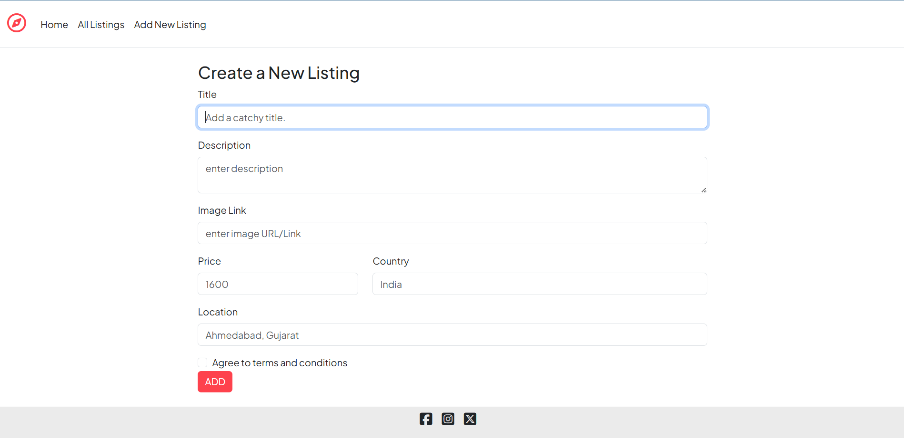

# YatraStay 🧳 | Full-Stack Travel Stay Booking Platform

YatraStay is a modern, feature-rich Airbnb clone web application designed to simulate real-world rental platform functionality. Discover, list, and manage beautiful stays from around the world with a responsive UI and robust backend.

---

## 🚀 Features

- **Modern Listings:** Add, edit, view, and delete property listings with images, descriptions, location, and price.
- **Responsive UI:** Built with Bootstrap 5 and custom CSS for a smooth experience on any device.
- **RESTful API:** Clean, scalable Express.js routes for all CRUD operations.
- **Validation & Error Handling:** Joi-powered server-side validation and custom error pages.
- **Database Integration:** MongoDB & Mongoose for fast, reliable data storage.
- **Starter Data:** Easily seed your database with beautiful sample listings.
- **Extensible Architecture:** Ready for authentication, booking, or payment features.

---

## 🏗️ Tech Stack

- **Frontend:** EJS templating, Bootstrap 5, Font Awesome, custom CSS
- **Backend:** Node.js, Express.js
- **Database:** MongoDB, Mongoose
- **Validation:** Joi

---
## 🖼️ Screenshots

Here are some screenshots showcasing YatraStay:

| Home Page | Listing Details | Add New Listing |
|-----------|----------------|-----------------|
|  |  |  |

---

## ⚡ Getting Started

1. **Clone the repo:**
   ```bash
   git clone https://github.com/divypanchal-13/YatraStay.git
   cd YatraStay
   ```

2. **Install dependencies:**
   ```bash
   npm install
   ```

3. **Seed the database (optional):**
   ```bash
   node init/index.js
   ```

4. **Start the server:**
   ```bash
   npm start
   ```
   Visit [http://localhost:8080](http://localhost:8080) in your browser.

---

## 📝 Project Structure

```
YatraStay/
├── models/
│   └── listing.js
├── views/
│   ├── listings/
│   ├── layouts/
│   ├── includes/
│   └── error.ejs
├── public/
│   └── css/
├── utils/
│   ├── warpAsync.js
│   └── ExpressError.js
├── init/
│   ├── index.js
│   └── data.js
├── app.js
└── schema.js
```

---

## 💡 Future Improvements

- User authentication & JWT security
- Booking and payment integration
- Advanced search and filtering
- User reviews and ratings
- Cloud image uploads

---

## 🙌 Credits

- [Bootstrap](https://getbootstrap.com/)
- [Font Awesome](https://fontawesome.com/)
- [Unsplash](https://unsplash.com/) for sample images

---

## 📄 License

MIT

---

> **YatraStay** – Your next getaway, just a click away! 🌏✨

---

### 🔖 Made with ❤️ by [Divy Panchal](https://www.linkedin.com/in/divy-panchal-02923028a/)

---

**Feel free to fork, star, and contribute!**
#
